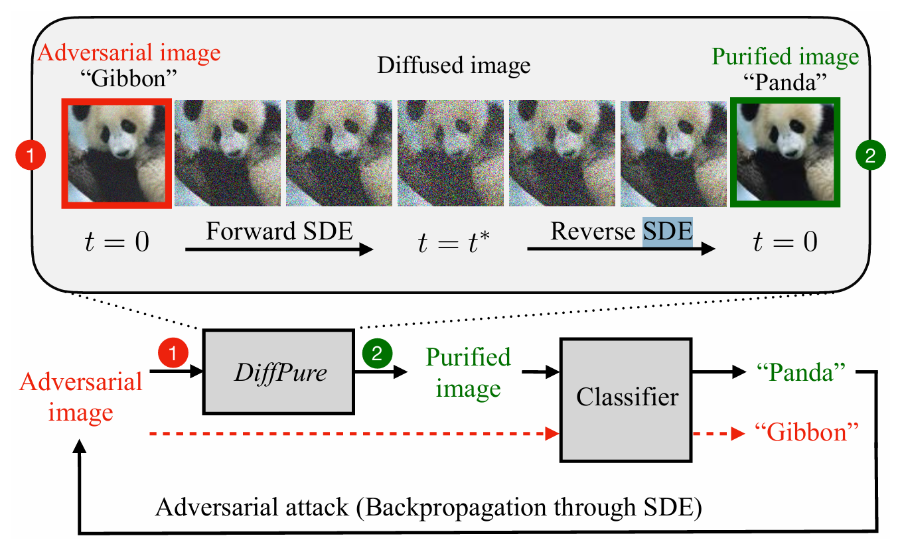
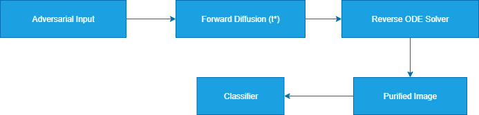
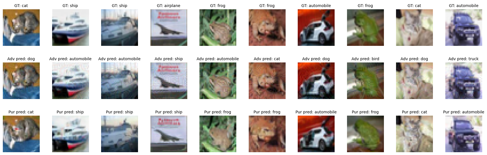

# 🌀 PureDiff — Diffusion Models for Adversarial Purification

**Author:** Utkarsh Chauhan  
**Institute:** IIIT Allahabad  
**Thesis:** M.Tech — *Diffusion Models for Adversarial Purification*  
**Advisor:** Dr. K. P. Singh  

---

## 📖 Overview

This repository implements a **diffusion-based adversarial purification pipeline** inspired by [DiffPure (Nie et al., 2022)](https://arxiv.org/abs/2205.07460).  
The goal is to defend pretrained classifiers against unseen adversarial attacks **without retraining**, using forward–reverse diffusion dynamics.

---

## 🧠 Core Idea

Given an adversarial image `x_adv`, we:
1. **Diffuse** it slightly (forward process) to wash out high-frequency adversarial noise.  
2. **Integrate** the reverse ODE to recover a *purified* image.  
3. **Feed** the purified output to a frozen classifier (e.g., RobustBench CIFAR-10).

<p align="center">
  
</p>

---

## ⚙️ Implementation Details

- **Diffusion Backbone:** `google/ddpm-cifar10-32` (UNet from 🤗 Diffusers)
- **Reverse Process:** Variance Preserving ODE (VP-ODE) solved via `torchdiffeq.odeint_adjoint`
- **Attacks Tested:** FGSM, PGD (L∞), and AutoAttack (RAND, EOT=20)
- **Classifier:** Standard pretrained CIFAR-10 from RobustBench
- **Dataset:** CIFAR-10 (subset of 512 samples for evaluation)
- **Environment:** Python ≥3.10, PyTorch ≥2.0, diffusers ≥0.29, robustbench ≥1.1

---

## 🧩 Pipeline

<p align="center">
  
</p>

### Key Steps

1. **Forward Diffusion (q(xₜ|x₀))** — Adds Gaussian noise with timestep `t* ∈ [0.05, 0.15]`  
2. **Reverse ODE Integration** — Solves deterministic probability flow ODE to reconstruct `x₀`  
3. **Evaluation Metrics:** Clean, adversarial, and purified accuracies on CIFAR-10 subset

---

## 🚀 Results

| Metric   |  Clean  | Adversarial (PGD) |  Purified   |
| :------- | :-----: | :---------------: | :---------: |
| Accuracy | ~92.2 % |       ~0 %        | **~81.2 %** |

<p align="center">
  <br>
  <em>Original (top), Adversarial (middle), Purified (bottom)</em>
</p>

---

## 🧪 Notebook

Open the notebook to reproduce all experiments:

```bash
PureDiff_v3.ipynb
````

Includes:

* CIFAR-10 adversarial generation (FGSM, PGD)
* Diffusion purification routine
* Visualization utilities
* Quantitative evaluation summary

---

## 📦 Installation

```bash
git clone https://github.com/im-utkarsh/PureDiff.git
cd PureDiff
pip install -r requirements.txt
```

Example `requirements.txt`:

```
torch>=2.0
torchvision
diffusers>=0.29
transformers>=4.39
accelerate>=0.25
safetensors>=0.4.2
robustbench>=1.1
torchdiffeq==0.2.3
matplotlib
```

---

## 🧰 Usage

1. Open `PureDiff_v3.ipynb`
2. Run all cells sequentially
3. Adjust key hyperparameters inside the notebook:

   ```python
   T_FORWARD = 0.10   # diffusion timestep
   step_size = 1e-3   # ODE integration step
   attack = 'pgd'     # or 'fgsm', 'autoattack'
   ```
4. Results and purified grids are saved automatically in `/outputs/`.

---

## 🧭 Acknowledgments

Based on:

* **Nie et al., DiffPure: Diffusion Models for Adversarial Purification (ICML 2022)**
* **RobustBench** for pretrained robust classifiers
* **🤗 Diffusers** for diffusion model pipelines

---